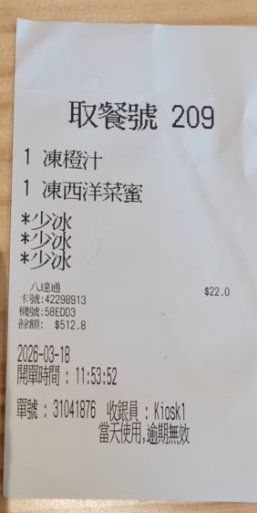

# 智能收据识别助手（开发中）

## 📌 项目简介
针对香港本地中英文混合收据的自动化记账工具，拍照上传即可提取消费信息。

## 🛠️ 技术栈
- **OCR引擎**：PaddleOCR
- **语义纠错**：DeepSeek API (Prompt Engineering)
- **前端**：Streamlit（规划中）
- **数据存储**：SQLite（规划中）

## 📷 当前效果

## 🚀 已实现功能
- 收据图像文字提取（PaddleOCR）
- 香港繁体中文识别测试通过
- DeepSeek API调用模块（进行中）

## 🔜 下一步计划
- [ ] 完善Prompt Engineering，稳定输出JSON
- [ ] 搭建Streamlit Web界面
- [ ] 接入SQLite实现数据持久化

## 📂 文件说明
- `app.py`：主程序入口（开发中）
- `ocr_test.py`：PaddleOCR测试脚本
- `test.png`：香港本地收据识别效果截图
